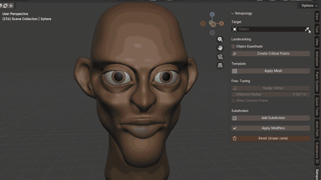

<h1 align="center">Victor Gava Senema</h1>

  <b>Computer Science student @ UFU</b> 
  Computer Vision &nbsp;·&nbsp; 3D Geometry Processing &nbsp;·&nbsp; Machine Learning

  

 

## About Me

Undergraduate Computer Science student at **UFU — Universidade Federal de Uberlândia**, focused on **computer vision** and **machine learning**.

I'm currently building my capstone project: a Blender extension that automates the retopology of 3D head models that turns dense, hard-to-edit meshes into clean, animation-ready quad topology.

**Spoken languages:** Portuguese (native) &nbsp;·&nbsp; English (advanced)

 

## Featured Project — Blender Retopology Extension

**[Blender_Retopology_Extension](https://github.com/victorsenema/Blender_Retopology_Extension)**

  

A Blender add-on that fits a clean quad template onto a 3D head mesh, so the artist ends up with usable topology without retopologizing by hand.

**How the fitting works**

- **Critical points.** The user marks the critical regions that define the mesh's edge loops: mouth, eyes, nose, jawline. A symmetry solver mirrors them across the X axis, so only one half is placed by hand.

- **Thin Plate Spline warp.** Each critical point is paired with its counterpart on the template, and a **Thin Plate Spline (TPS)** deformation interpolates the warp across every remaining vertex, bending the template into the target's proportions instead of just scaling it.

- **Blender's native toolset.** The fit is finished with Blender's own functions, such as **Shrinkwrap** and **Subdivision Surface**.

 

## Tech Stack

<table>
  <tr>
    <td><b>Languages</b></td>
    <td>
      
      &nbsp;<code>SQL</code>
    </td>
  </tr>
  <tr>
    <td><b>Machine Learning &amp; Computer Vision</b></td>
    <td>
      
      &nbsp;<code>YOLO / Ultralytics</code> <code>NumPy</code> <code>Pandas</code>
    </td>
  </tr>
  <tr>
    <td><b>Data &amp; Databases</b></td>
    <td>
      
    </td>
  </tr>
  <tr>
    <td><b>Tools</b></td>
    <td>
      
      &nbsp;<code>Jupyter</code>
    </td>
  </tr>
  <tr>
    <td><b>3D &amp; Graphics</b></td>
    <td>
      
      &nbsp;<code>Blender Python API</code> <code>bmesh</code>
    </td>
  </tr>
</table>

 

## Projects

| Project | Description |
| :--- | :--- |
| **[License-Plate-Recognizer](https://github.com/victorsenema/License-Plate-Recognizer)** | License plate detection and recognition pipeline. The model was trained on a public dataset, but every plate was **labelled manually** to build the training set, and the whole training run was done locally on my own machine. |
| **[Math-Expression-Interpreter](https://github.com/victorsenema/Math-Expression-Interpreter)** | An interpreter for mathematical expressions written in **C** — it tokenizes, parses and evaluates arithmetic expressions from scratch. |
